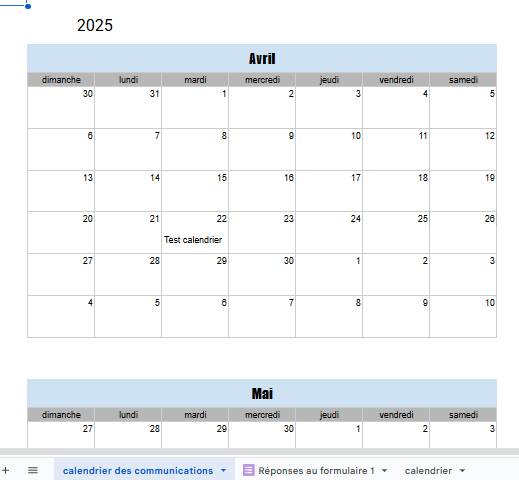
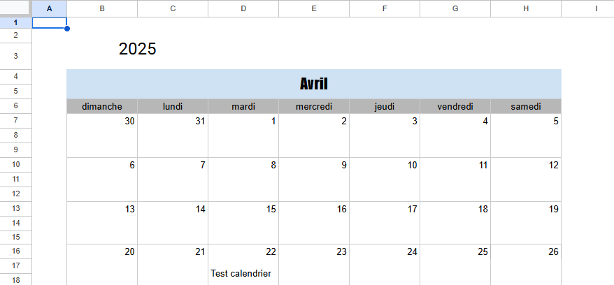
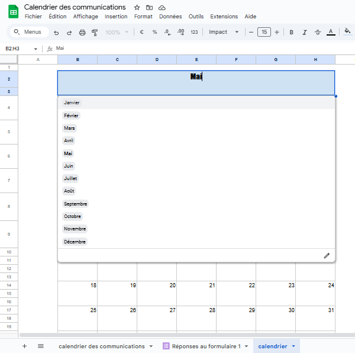
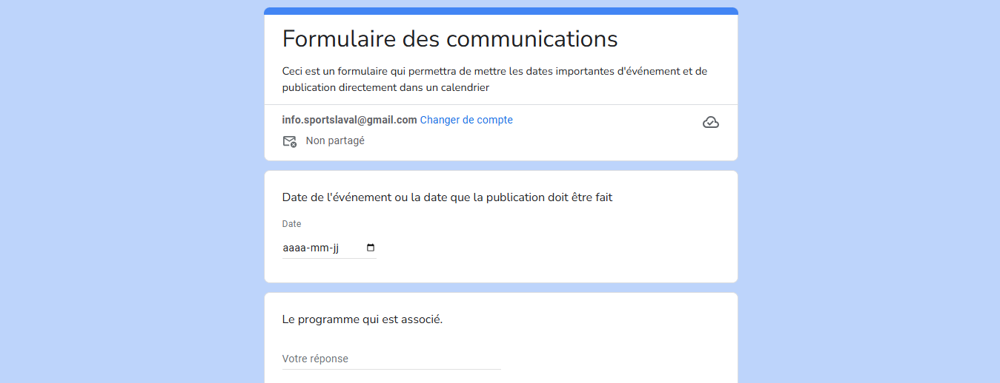
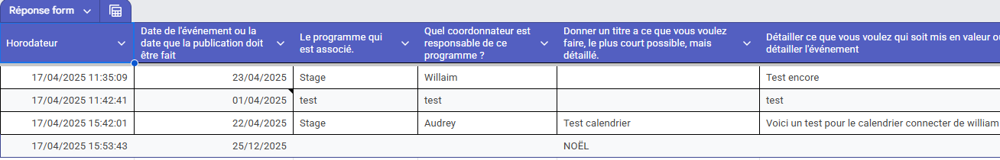

# Poposition Créative de William Rathier Mailly
## idée de la proposition

Le but de la proposition créative est de prorposer une idée à l'employeur de mon stage afin d'aider la compagnie a régler un problème au sein de la compagnie. Ce qui va aider la compagnie a mieux travailler.

### Calendrier Connectés
#### Idée
L'idée du calendrier connecté est de faire en sorte que tout le monde peut ajouter des dates importantes au calendrier sans devoir faire trop d'effort. Ce qui va aider avec la communication et les employer n'aurons pas a prendre  ans pour faire la note dans le calendrier.

#### Planification
La façon de faire est, u formulaire est créer demandant le nom de l'événement, la date, quel programme est relié et qui est repsonsable de ce programme ou événement. Toutes ces réponses sont ensuite envoyé dans un tableau google sheet automatiquement et ensuite le titre de l'événement est créer. Donc, les personnes qui répondent au formulaire n'ont rien d'autre à faire autre que de répondre le reste est créer automatiquement.

## Image

- Le calendrier
  

- Le reste du calendrier
  

- la liste des mois dans l'autre calendrier
  

- Le formulaire
  

- Le reste du formulaire
  

- Les réponses du formulaire dans le google sheet
  

### En pratique
En pratique le calendrier n'est pas facile d'implanté l'idée dans l'entreprise, car les employés ont déjà leur calendrier qu'ils utilisent. Par contre pou ce qui est d'un calendrier commun pour une idée plus précise comme exemple le calendrier des publications c'est plus simple d'utiliser. Parce que ça aide les employés a se référer à un endroit plutôt que de devoir vérifier dans le calendrier de chacun pour voir ce qui arrive prochainement.

Aussi, mon premier exemple pour l'utilsation du calendrier est de planifier les publicaations pour une entreprise en lien avec SPorts Laval, mais qui est externe, donc le calendrier vient à la rescourse, car pas besoin d'être dans nos fichiers ou sur place pour planifier les publications, la personne a juste besoin de remplir le formulaire et tout sera transmis dans le fichier google sheet auquel les gens des communications ont accès.

